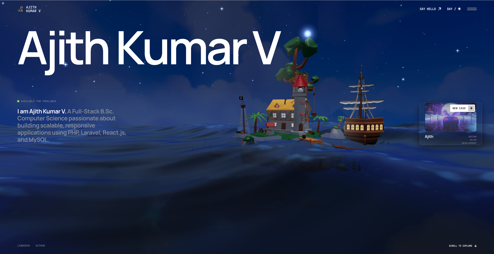
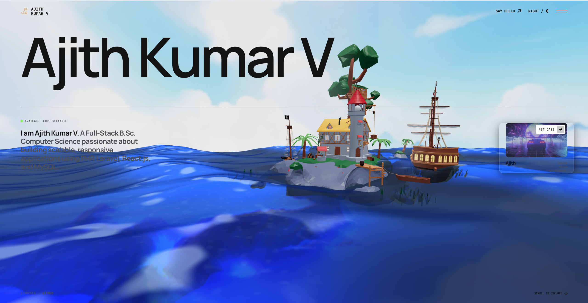

<div align="center">

# ✨ Ajith Kumar V — 3D Developer Portfolio



### 🌊 Immersive 3D Portfolio Experience Built With Modern Web Technologies

<p align="center">
  <a href="https://github.com/yourusername">
    
  </a>
  
  <a href="https://react.dev/">
    
  </a>

  <a href="https://vitejs.dev/">
    
  </a>

  <a href="https://threejs.org/">
    
  </a>

  <a href="https://greensock.com/gsap/">
    
  </a>

  <a href="https://developer.mozilla.org/en-US/docs/Web/JavaScript">
    
  </a>

</p>

---

### 🚀 Live Demo

🔗 **Portfolio Website:**  
[Visit Portfolio](https://ajith-portfolio-2026.vercel.app)

</div>

---

# 🌌 About The Portfolio

This portfolio is a modern immersive 3D web experience designed to showcase my projects, development skills, creativity, and UI/UX expertise.

The website combines smooth animations, interactive 3D environments, dynamic transitions, and responsive layouts to create a cinematic browsing experience.

---

# 🖼️ Portfolio Preview

## ☀️ Day Mode



---

## 🌙 Night Mode


---

# ⚡ Tech Stack

<div align="center">

| Technology | Purpose |
|------------|---------|
| ⚛️ React JS | Frontend Framework |
| ⚡ Vite JS | Fast Build Tool |
| 🎨 CSS3 | Styling & Layout |
| 🟨 JavaScript | Application Logic |
| 🌌 Three JS | 3D Rendering |
| 🎬 GSAP | Smooth Animations |
| 📱 Responsive Design | Mobile Compatibility |

</div>

---

# ✨ Features

✅ Interactive 3D Scene  
✅ Smooth GSAP Animations  
✅ Dark / Light Mode  
✅ Responsive Design  
✅ Creative UI/UX  
✅ Modern Portfolio Layout  
✅ Fast Loading with Vite  
✅ Animated Transitions  
✅ Project Showcase Section  
✅ Contact & Social Integration  

---

# 📂 Project Structure

```bash
Portfolio/
│
├── public/
│   └── img/
│       └── models/
│           ├── Day.png
│           ├── Night.png
│
├── src/
│   ├── components/
│   ├── pages/
│   ├── assets/
│   ├── styles/
│   └── App.jsx
│
├── package.json
└── vite.config.js
```

---

# 🛠️ Installation

## Clone Repository

```bash
git clone https://github.com/yourusername/portfolio.git
```

## Navigate To Project

```bash
cd portfolio
```

## Install Dependencies

```bash
npm install
```

## Run Development Server

```bash
npm run dev
```

---

# 📦 Build For Production

```bash
npm run build
```

---

# 🚀 Deployment

This portfolio is deployed using:

<div align="center">


</div>

### Deploy Easily On Vercel

```bash
npm run build
```

Upload the `dist` folder or connect GitHub repository directly with Vercel.

---

# 🎨 UI Inspiration

The design focuses on:

- Minimal Modern UI
- Cinematic 3D Experience
- Interactive Ocean Environment
- Floating Elements
- Smooth Motion Design
- Clean Typography
- Dark/Light Theming

---

# 📸 Screenshots


<br/><br/>


---

# 🧠 Learning Highlights

While building this portfolio, I explored:

- Three.js scene management
- GSAP timeline animations
- React component architecture
- Vite optimization
- Responsive 3D UI
- Performance optimization
- Shader & lighting concepts

---

# 👨‍💻 Developer

## Ajith Kumar V

💼 Full Stack Developer  
🎓 B.Sc Computer Science  
⚛️ React JS Developer  
🐘 PHP & Laravel Developer  
🎨 UI/UX Enthusiast  
🌌 Creative Frontend Designer  

---

# 📬 Connect With Me

<div align="center">

<a href="https://linkedin.com/in/yourprofile">
  
</a>

<a href="https://github.com/yourusername">
  
</a>

<a href="mailto:yourmail@gmail.com">
  
</a>

</div>

---

# ⭐ Support

If you like this portfolio:

🌟 Star the repository  
🍴 Fork the project  
📢 Share with others  

---

<div align="center">

# 🚀 Crafted With Passion & Creativity


</div>
